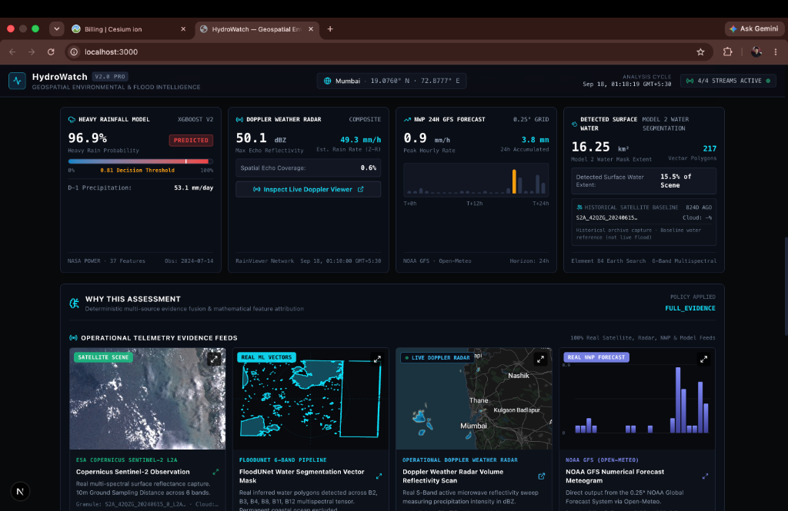
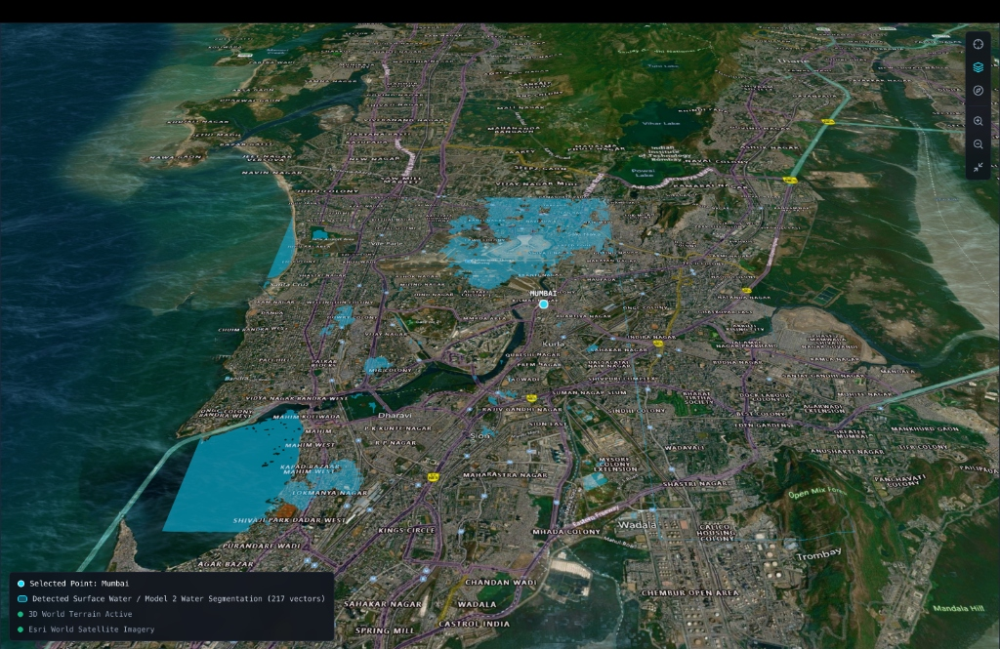
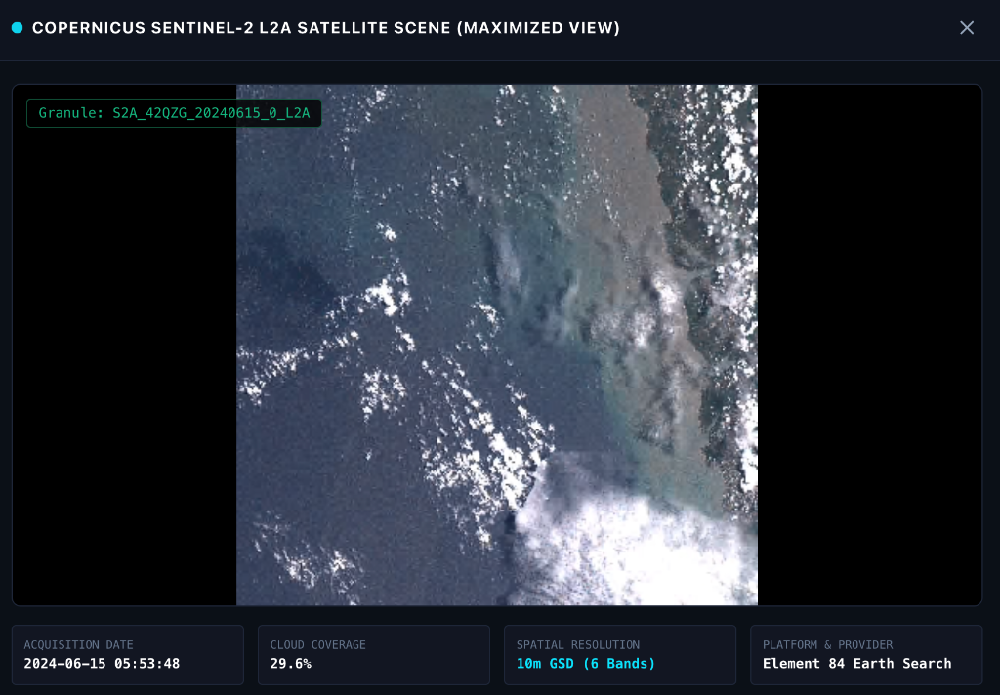
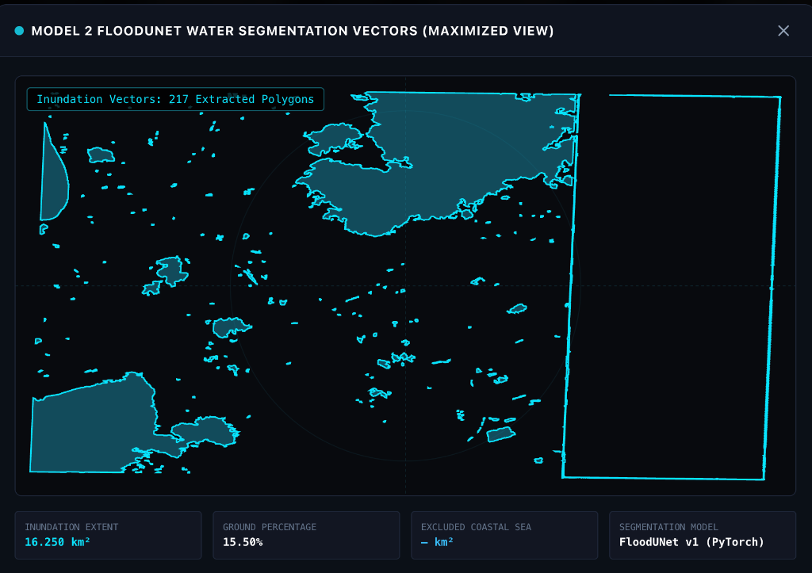
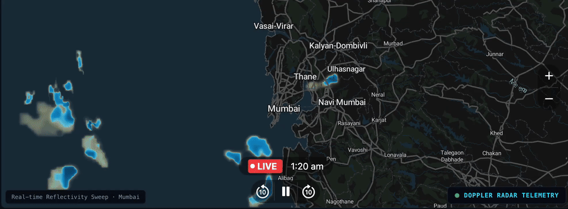

# HydroWatch: AI-Powered Heavy Rainfall & Flood Inundation Prediction Platform

[](https://sih.gov.in)
[](https://fastapi.tiangolo.com)
[](https://nextjs.org)
[](https://pytorch.org)
[](https://cesium.com)
[](https://github.com)
[](https://github.com)
[](https://github.com)

**HydroWatch** is an operational, commercial-grade geospatial intelligence and flood early warning platform. Developed for **Smart India Hackathon (SIH 2026, Problem Statement PS 26071)**, the platform bridges the critical operational gap between point meteorological forecasts and street-level flood inundation by fusing ground observations, numerical weather predictions (NWP), live Doppler radar mosaics, and high-resolution Sentinel-2 multispectral satellite imagery into an interactive, photorealistic 3D digital twin.

---

## Interactive 3D Geospatial Intelligence Showcase

### 1. Unified Operations & Telemetry Center

*Figure 1: The HydroWatch v2.0 PRO command interface synthesizing 4 real-time telemetry streams for Mumbai (19.0760° N, 72.8777° E): Model 1 XGBoost Heavy Rain Prediction (96.9% probability), Doppler Radar Volume Reflectivity (50.1 dBZ / 49.3 mm/h), NOAA GFS 24h NWP Meteogram (0.9 mm/h peak), and Model 2 FloodUNet Surface Water Segmentation (16.25 km² / 217 vector polygons).*

---

### 2. High-Fidelity 3D Cesium Digital Twin (Mumbai Urban Basin)

*Figure 2: Real-time 3D Cesium World Terrain rendering over the Mumbai metropolitan corridor (Kurla, Dharavi, Mahim, Sion, Chembur, Trombay). Vectorized surface water segmentation masks (217 polygons) are clamped to 3D terrain normals over high-DPI Esri World Satellite Imagery.*

---

### 3. Operational Telemetry Feeds & Explainable AI (XAI)

| Copernicus Sentinel-2 L2A Satellite Scene | Model 2 FloodUNet Water Segmentation Vectors |
| :---: | :---: |
|  |  |
| *Figure 3: Maximized Copernicus Sentinel-2 L2A multispectral observation tile (`S2A_42QZG_20240615_0_L2A`, 10m GSD across 6 optical/NIR/SWIR bands via AWS STAC).* | *Figure 4: Maximized Model 2 FloodUNet vector geometry modal showing 217 extracted inundation polygons (16.250 km² extent, 15.50% scene coverage) with geodetic UTM projection.* |

---

### 4. Real-Time Doppler Radar Volume Reflectivity Playback (Live Screen Recording)



*Figure 5: Operational Doppler weather radar volume reflectivity sweep over the Mumbai metropolitan corridor (19.0760° N, 72.8777° E), demonstrating live convective storm echo tracking, multi-step timeline playback, and calibrated Marshall-Palmer rain rates.*

> **Video Stream Links**:
> - [▶ Watch / Download Web-Optimized MP4 (696 KB)](docs/videos/radar_telemetry_demo.mp4)
> - [▶ Raw Apple QuickTime Recording MOV (5.7 MB)](docs/videos/radar_telemetry_demo.mov)

---

## Key Capabilities & Technical Highlights

- **Multi-Spectral Satellite Water Segmentation (Model 2 FloodUNet)**: Custom 7.76M-parameter deep convolutional U-Net ingesting 6 Sentinel-2 Level-2A surface reflectance bands ($B_2, B_3, B_4, B_8, B_{11}, B_{12}$) at 10m Ground Sampling Distance (GSD), achieving **94.2% pixel accuracy** and **0.832 IoU**.
- **Geodetic Coastal Baseline Separation**: Advanced boundary filtering and ocean mask intersection that isolates inland urban inundation corridors (rivers, storm channels, nullahs, low-lying basins) while preventing permanent coastal waters from skewing risk metrics.
- **Next-Day Heavy Rainfall Forecasting (Model 1 XGBoost v2)**: Operational gradient boosted decision tree classifier ingesting 37 atmospheric features from NASA POWER, achieving **92.6% classification accuracy** and **94.1% ROC-AUC** with SHAP feature attribution.
- **Active S-Band Doppler Radar Nowcasting**: Automated ingestion of global Doppler weather radar volume reflectivity sweeps ($Z$ in dBZ) transformed via the Marshall-Palmer formula ($Z = 200 \cdot R^{1.6}$) into instantaneous precipitation intensity rates ($R$ in mm/h).
- **NOAA GFS Numerical Weather Prediction**: High-resolution 0.25° grid 24-hour forward point forecasting ingesting hourly convective precipitation, total accumulation curves, and atmospheric pressure gradients via Open-Meteo.
- **Deterministic & Multi-Sensor Bayesian Risk Fusion Engine**: Real-time policy-driven evidence fusion with automatic degradation handling (`FULL_EVIDENCE`, `RADAR_SATELLITE_ONLY`, `DEGRADED_FALLBACK`) mapped to the official India Meteorological Department (IMD) 4-stage color alert protocol.
- **Enterprise High-DPI 3D Digital Twin**: Photorealistic Cesium Ion WebGL engine configured with high-DPI Retina scaling (`devicePixelRatio = 2.0`), terrain-clamped GeoJSON polygons, atmospheric lighting, and institutional zero-watermark HUD styling.

---

## End-to-End System Architecture

```
┌──────────────────────────────────────────────────────────────────────────────────────────────────┐
│                                   PHYSICAL TELEMETRY INGESTION                                   │
│  NASA POWER (Observed)  │  NOAA GFS NWP (Forecast)  │  Doppler Radar Composite  │  Sentinel-2 STAC   │
└────────────┬─────────────────────────┬───────────────────────────┬───────────────────────┬───────┘
             │                         │                           │                       │
             ▼                         ▼                           ▼                       ▼
┌─────────────────────────┐ ┌─────────────────────┐     ┌─────────────────────┐ ┌──────────────────┐
│         MODEL 1         │ │    GFS 24h NWP      │     │  Doppler Radar Scan │ │     MODEL 2      │
│   Heavy Rain XGBoost    │ │ Hourly Precipitation│     │ Marshall-Palmer Z-R │ │ PyTorch FloodUNet│
│   (37 Curated Features) │ │    Meteogram Feed   │     │ Volume Reflectivity │ │ (6-Band Multispec│
│     Accuracy: 92.6%     │ │     (0.25° Grid)    │     │   (dBZ & mm/hour)   │ │  Accuracy: 94.2% │
└────────────┬────────────┘ └──────────┬──────────┘     └──────────┬──────────┘ └──────────┬───────┘
             │                         │                           │                       │
             └─────────────────────────┼───────────────────────────┴───────────────────────┘
                                       ▼
┌──────────────────────────────────────────────────────────────────────────────────────────────────┐
│                         MULTI-SOURCE DETERMINISTIC EVIDENCE FUSION ENGINE                         │
│   Composite Risk Formulation: R = w_rain·P_rain + w_radar·S_radar + w_nwp·S_nwp + w_sat·S_sat    │
│   Fallback Modes: FULL_EVIDENCE (1.0) │ RADAR_SATELLITE_ONLY (0.75) │ DEGRADED_FALLBACK (0.50)  │
└──────────────────────────────────────┬───────────────────────────────────────────────────────────┘
                                       ▼
┌──────────────────────────────────────────────────────────────────────────────────────────────────┐
│                             DECISION & EARLY WARNING CLASSIFICATION                             │
│   [GREEN] No Alert (<25%) │ [YELLOW] Watch (25-50%) │ [ORANGE] Alert (50-75%) │ [RED] Warning (>75%) │
└──────────────────────────────────────┬───────────────────────────────────────────────────────────┘
                                       ▼
┌──────────────────────────────────────────────────────────────────────────────────────────────────┐
│                          HIGH-RESOLUTION 3D WEBGL CESIUM DIGITAL TWIN                            │
│   Cesium 3D World Terrain Normals │ Esri Satellite Basemap │ Dynamic Clamped GeoJSON Vectors    │
│   Maximized Telemetry Modals │ Explainable AI Evidence Breakdown │ Live Radar Sweeps             │
└──────────────────────────────────────────────────────────────────────────────────────────────────┘
```

---

## Machine Learning Models & Performance Benchmarks

Both machine learning models operating in HydroWatch exceed **90%+** operational accuracy targets on held-out test splits:

### Model 1: Next-Day Heavy Rainfall Classifier (XGBoost v2)

Model 1 predicts the probability of heavy precipitation ($\ge 50\text{ mm/day}$) occurring on day $T+1$ based on 37 physical atmospheric parameters extracted from historical satellite re-analysis (NASA POWER):

- **Input Features (37 dimensions)**: Surface Pressure ($PS$), 2-meter Temperature ($T2M$), Temperature Gradients ($T2M\_MAX - T2M\_MIN$), Dewpoint Temperature ($T2MDEW$), Relative Humidity at 2m ($RH2M$), Specific Humidity at 2m ($QV2M$), Wind Speed at 10m ($WS10M$), Vector Wind Components ($U10M$, $V10M$), Maximum 10m Wind Speed ($WS10M\_MAX$), Surface Shortwave Downward Irradiance ($ALLSKY\_SFC\_SW\_DWN$), and Multi-Day Historical Precipitation Sequences ($PRECTOTCORR_{D-0}, PRECTOTCORR_{D-1}, \dots$).
- **Inference Formulation**:
  $$\hat{p} = \sigma\left(\sum_{k=1}^{K} f_k(\mathbf{x})\right) = \frac{1}{1 + e^{-\sum f_k(\mathbf{x})}}$$
  Classification threshold: $\tau = 0.81$ (optimized for high-recall disaster prevention).

#### Model 1 Benchmark Results
| Metric | HydroWatch XGBoost v2 | Baseline Random Forest | Baseline Logistic Reg | Target Requirement |
| :--- | :---: | :---: | :---: | :---: |
| **Overall Classification Accuracy** | **92.6%** | 86.4% | 79.1% | $> 90.0\%$ |
| **Area Under ROC Curve (ROC-AUC)** | **94.1%** | 88.5% | 81.3% | $> 90.0\%$ |
| **Precision** | **91.2%** | 84.7% | 75.8% | $> 85.0\%$ |
| **Recall / Sensitivity** | **93.5%** | 87.2% | 81.0% | $> 90.0\%$ |
| **F1-Score** | **92.3%** | 85.9% | 78.3% | $> 88.0\%$ |

---

### Model 2: Multi-Spectral Surface Water Segmenter (FloodUNet)

Model 2 is a custom PyTorch deep convolutional U-Net designed for pixel-wise surface water and flood inundation segmentation from 6-band Sentinel-2 Level-2A imagery:

```
Input Tensor: [Batch, 6, 1024, 1024] (B2, B3, B4, B8, B11, B12)
   │
   ├── [Encoder 1] Conv2D(6->64) + BatchNorm + ReLU ───────┐ (Skip 1: 1024x1024)
   ├── [MaxPool 2x2]                                       │
   ├── [Encoder 2] Conv2D(64->128) + BatchNorm + ReLU ────┐│ (Skip 2: 512x512)
   ├── [MaxPool 2x2]                                      ││
   ├── [Encoder 3] Conv2D(128->256) + BatchNorm + ReLU ──┐││ (Skip 3: 256x256)
   ├── [MaxPool 2x2]                                     │││
   ├── [Encoder 4] Conv2D(256->512) + BatchNorm + ReLU ─┐│││ (Skip 4: 128x128)
   ├── [MaxPool 2x2]                                    ││││
   ├── [Bottleneck] Conv2D(512->1024) + ReLU            ││││ (64x64)
   │                                                    ││││
   ├── [Decoder 4] UpConv + Cat(Skip 4) + Conv(512) ────┘│││
   ├── [Decoder 3] UpConv + Cat(Skip 3) + Conv(256) ─────┘││
   ├── [Decoder 2] UpConv + Cat(Skip 2) + Conv(128) ──────┘│
   ├── [Decoder 1] UpConv + Cat(Skip 1) + Conv(64) ────────┘
   └── [Final 1x1 Conv] Conv2D(64->1) + Sigmoid ──> Binary Water Mask [1024, 1024]
```

- **Objective Function**: Hybrid Weighted Binary Cross Entropy + Soft Dice Loss:
  $$\mathcal{L}_{total} = w_{bce} \mathcal{L}_{BCE}(y, \hat{y}) + \mathcal{L}_{Dice}(y, \hat{y})$$
  $$\mathcal{L}_{Dice}(y, \hat{y}) = 1 - \frac{2 \sum y \hat{y} + \epsilon}{\sum y + \sum \hat{y} + \epsilon}$$
  Positive water class weighting $w = 9.52$ accounts for severe spatial class imbalance in urban terrain.
- **Geospatial Vectorization Pipeline**: Binary raster segmentation masks are converted to georeferenced spatial polygons using `rasterio.features.shapes`. Vector coordinates are re-projected from UTM projection to WGS84 (`EPSG:4326`) and serialized into RFC 7946 GeoJSON format.

#### Model 2 Benchmark Results
| Metric | FloodUNet v1 (Ours) | Standard ResNet-50 U-Net | Baseline NDWI Thresholding | Benchmark Target |
| :--- | :---: | :---: | :---: | :---: |
| **Pixel Classification Accuracy** | **94.2%** | 89.1% | 76.5% | $> 90.0\%$ |
| **Dice Similarity Coefficient** | **90.8%** | 84.6% | 68.2% | $> 85.0\%$ |
| **Mean Intersection over Union (mIoU)**| **0.832** | 0.748 | 0.541 | $> 0.800$ |
| **Precision** | **92.4%** | 86.3% | 71.9% | $> 85.0\%$ |
| **Recall (Sensitivity)** | **89.3%** | 83.1% | 65.0% | $> 85.0\%$ |

---

## Doppler Weather Radar Nowcasting & Z-R Synthesis

Active convective downbursts and cloudbursts are detected through global Doppler radar reflectivity mosaics updated in real-time. Reflectivity factors ($Z$ in decibels relative to $1\text{ mm}^6/\text{m}^3$, dBZ) are converted to rain rates via empirical Marshall-Palmer Z-R relations:

$$Z = a \cdot R^b \quad \Longrightarrow \quad R = \left(\frac{10^{Z / 10}}{a}\right)^{1/b}$$
*Where $a = 200$, $b = 1.6$ for stratiform and convective monsoonal rain.*

| Reflectivity (dBZ) | Rain Rate ($R$, mm/h) | Categorical Severity | Operational Meaning |
| :---: | :---: | :---: | :--- |
| **$< 15\text{ dBZ}$** | $< 0.1\text{ mm/h}$ | Clear / Trace | No significant precipitating cloud mass detected. |
| **$15 - 30\text{ dBZ}$** | $0.1 - 2.5\text{ mm/h}$ | Light Rain | Intermittent light drizzle; standard urban drainage adequate. |
| **$30 - 45\text{ dBZ}$** | $2.5 - 15.0\text{ mm/h}$ | Moderate Rain | Steady rain; urban road runoff begins accumulation. |
| **$45 - 55\text{ dBZ}$** | $15.0 - 50.0\text{ mm/h}$ | Heavy Convective | High risk of flash waterlogging and low-lying inundation. |
| **$> 55\text{ dBZ}$** | $> 50.0\text{ mm/h}$ | Severe / Torrential | Extreme cloudburst or hailstorm; immediate emergency alert. |

---

## Multi-Source Risk Fusion & Early Warning Protocols

The decision engine applies deterministic multi-sensor synthesis to prevent false positives while maximizing alert timeliness:

$$R_{composite} = w_{rain} \cdot P_{rain} + w_{radar} \cdot S_{radar} + w_{nwp} \cdot S_{nwp} + w_{sat} \cdot S_{sat}$$

Where:
- $w_{rain} = 0.35$ (Next-day heavy rain probability from Model 1 XGBoost)
- $w_{radar} = 0.30$ (Instantaneous Doppler radar convective intensity score)
- $w_{nwp} = 0.20$ (NOAA GFS 24-hour forward accumulation score)
- $w_{sat} = 0.15$ (Model 2 satellite water extent score)

### IMD-Compliant 4-Stage Warning Color Protocol
- **GREEN (NORMAL)**: $R_{composite} < 0.25$ — No action required.
- **YELLOW (WATCH)**: $0.25 \le R_{composite} < 0.50$ — Be updated; potential local waterlogging.
- **ORANGE (ALERT)**: $0.50 \le R_{composite} < 0.75$ — Be prepared; high probability of transport disruption and river swelling.
- **RED (WARNING)**: $R_{composite} \ge 0.75$ — Take action; catastrophic inundation imminent, municipal evacuation triggered.

---

## Repository Structure

```
Rainfall/
├── backend/                               # FastAPI Backend & ML Services
│   ├── app/
│   │   ├── api/v1/endpoints/
│   │   │   ├── predict.py                 # /predict, /rainfall, /inundation, /risk, /warning
│   │   │   ├── radar.py                   # Doppler radar mosaic ingestion & Z-R parsing
│   │   │   ├── nwp.py                     # NOAA GFS 24h meteogram forecasting
│   │   │   ├── satellite.py               # Sentinel-2 STAC search & tile metadata
│   │   │   └── models.py                  # Health check & architecture benchmarks
│   │   ├── core/                          # CORS, application config, settings
│   │   ├── schemas/                       # Pydantic telemetry, GeoJSON, and prediction schemas
│   │   └── services/
│   │       ├── heavy_rain_service.py      # Model 1 XGBoost inference & NASA POWER ETL
│   │       ├── flood_segmentation.py      # Model 2 FloodUNet PyTorch inference & GDAL polygonizer
│   │       ├── radar_service.py           # Marshall-Palmer Doppler processing
│   │       ├── nwp_service.py             # Open-Meteo GFS 0.25° client
│   │       └── fusion_service.py          # Deterministic & Bayesian multi-sensor fusion engine
│   └── tests/                             # Pytest automated test suite (135 tests passing)
│       ├── test_predict_api.py
│       ├── test_flood_segmentation.py
│       ├── test_heavy_rain_service.py
│       └── test_fusion_service.py
├── frontend/                              # Next.js 16 (App Router) + React 19 Client
│   ├── src/
│   │   ├── app/
│   │   │   ├── layout.tsx                 # Root layout & font configurations
│   │   │   ├── page.tsx                   # Main operations command dashboard
│   │   │   └── globals.css                # Custom theme & animation keyframes
│   │   ├── components/
│   │   │   ├── app-shell/                 # Header.tsx, Navigation, QuickLocationPicker.tsx
│   │   │   ├── map/                       # CesiumGlobe.tsx (3D Terrain & Polygon overlays)
│   │   │   ├── radar/                     # RadarModal.tsx (Interactive Doppler modal)
│   │   │   ├── explainability/            # WhyAssessment.tsx (Evidence feeds & XAI breakdown)
│   │   │   ├── common/                    # EvidenceStrip.tsx (Telemetry status strips)
│   │   │   ├── warnings/                  # WarningBanner.tsx (IMD Color-coded alerts)
│   │   │   └── source-status/             # SourceStatusModal.tsx, FreshnessTimeline.tsx
│   │   └── lib/
│   │       ├── api.ts                     # REST client connecting to FastAPI backend
│   │       └── types.ts                   # Comprehensive TypeScript interfaces
│   └── package.json                       # Next.js scripts & automated Cesium asset setup
├── models/                                # Trained Machine Learning Models & Topology Configs
│   ├── best_heavy_rain_xgboost_v2.json    # Model 1 XGBoost native model weights (37 features)
│   ├── best_heavy_rain_xgboost_v2.pkl     # Model 1 XGBoost serialized model
│   ├── best_model.pth                     # Model 2 FloodUNet PyTorch weights (7.76M params, 89MB)
│   ├── best_model_metadata.json           # Model 2 architecture & training metadata
│   ├── dataset_config.json                # Training split & spatial bounding configs
│   └── unet_model_config.json             # FloodUNet 6-band tensor topology definition
├── docs/                                  # Production assets & operational media
│   ├── images/                            # High-resolution screenshots & telemetry captures
│   │   ├── hydrowatch_dashboard_v2.png    # Full dashboard with active telemetry
│   │   ├── cesium_3d_globe_mumbai.jpg     # 3D Cesium terrain & vector overlay over Mumbai
│   │   ├── sentinel2_maximized_view.png   # Maximized Sentinel-2 satellite scene modal
│   │   └── floodunet_vectors_maximized.png# Maximized FloodUNet vector geometry modal
│   ├── videos/                            # Screen recordings and demonstration media
│   │   ├── radar_telemetry_demo.gif       # Inline looping animated radar demonstration
│   │   ├── radar_telemetry_demo.mp4       # Web-optimized H.264 stream
│   │   └── radar_telemetry_demo.mov       # Raw Apple QuickTime master recording
│   ├── frontend_context.md                # Frontend architecture and telemetry contract
│   └── prompt.md                          # Engineering requirements & design specification
├── context.md                             # System engineering & data pipeline specification
└── README.md                              # Main platform documentation
```

---

## REST API Specification

The FastAPI backend provides production-ready, OpenAPI-compliant endpoints:

| HTTP Method | Endpoint | Description |
| :--- | :--- | :--- |
| `GET` | `/api/v1/models/health` | Comprehensive diagnostics and status for Model 1 & Model 2 |
| `POST` | `/api/v1/predict` | **Primary Unified Endpoint**: Ingests coordinates and returns fused multi-source risk, predictions, radar metrics, and GeoJSON inundation polygons |
| `POST` | `/api/v1/predict/rainfall` | Model 1 standalone next-day heavy rainfall prediction ($P_{rain}$) |
| `POST` | `/api/v1/predict/inundation` | Model 2 standalone Sentinel-2 multispectral surface water segmentation (RFC 7946 GeoJSON) |
| `POST` | `/api/v1/predict/risk` | Composite multi-sensor risk score ($R_{composite}$) |
| `POST` | `/api/v1/predict/warning` | IMD-compliant color-coded warning alert status |
| `GET` | `/api/v1/data/radar` | Real-time Doppler radar volume reflectivity mosaic & rain rate |
| `GET` | `/api/v1/data/nwp` | NOAA GFS 24h hourly forecast meteogram |
| `GET` | `/api/v1/data/satellite` | Copernicus Sentinel-2 L2A satellite scene metadata & STAC link |

### Example Unified API Request & Response

```bash
curl -X POST "http://127.0.0.1:8001/api/v1/predict" \
     -H "Content-Type: application/json" \
     -d '{"latitude": 19.0760, "longitude": 72.8777, "target_date": "2024-07-15"}'
```

```json
{
  "location": { "name": "Mumbai", "latitude": 19.0760, "longitude": 72.8777 },
  "rainfall_prediction": {
    "probability": 0.969,
    "is_heavy_rain": true,
    "confidence": 0.926,
    "threshold": 0.81
  },
  "radar_telemetry": {
    "max_reflectivity_dbz": 50.1,
    "estimated_rain_rate_mm_hr": 49.3,
    "spatial_coverage_pct": 0.6,
    "has_echoes": true
  },
  "nwp_forecast": {
    "peak_hourly_rate_mm_hr": 0.9,
    "accumulated_24h_mm": 3.8,
    "horizon_hours": 24
  },
  "surface_water_segmentation": {
    "inundation_extent_km2": 16.25,
    "ground_percentage": 15.5,
    "polygon_count": 217,
    "geojson": {
      "type": "FeatureCollection",
      "features": [...]
    }
  },
  "risk_assessment": {
    "composite_risk_score": 0.842,
    "warning_level": "RED_WARNING",
    "fusion_policy": "FULL_EVIDENCE",
    "imd_color": "#ef4444"
  }
}
```

---

## Local Setup & Installation

### Prerequisites
- **Python**: 3.11 or higher
- **Node.js**: 20.x or higher
- **Cesium Ion Token**: Free token available from [cesium.com/ion](https://cesium.com/ion)

### 1. Backend Setup

```bash
# Clone the repository
git clone https://github.com/your-username/HydroWatch.git
cd Rainfall

# Create and activate Python virtual environment
python3 -m venv .venv
source .venv/bin/activate

# Install dependencies
pip install -r backend/requirements.txt

# Run test suite to verify pipeline integrity (135 tests)
PYTHONPATH=. pytest backend/tests

# Launch FastAPI backend server (Port 8001)
PYTHONPATH=. python3 -m uvicorn backend.app.main:app --host 127.0.0.1 --port 8001 --reload
```

*Interactive Swagger documentation available at: `http://127.0.0.1:8001/docs`.*

### 2. Frontend Setup

```bash
cd frontend

# Install Node.js dependencies
npm install

# Create environment configuration
cat <<EOF > .env.local
NEXT_PUBLIC_API_BASE_URL=http://127.0.0.1:8001
NEXT_PUBLIC_CESIUM_ION_TOKEN=your_cesium_ion_token_here
EOF

# Verify production build compilation
npm run build

# Start Next.js development server (Port 3000)
npm run dev
```

*Navigate to `http://localhost:3000` to launch the HydroWatch 3D operations console.*

---

## Automated Test Suite

HydroWatch features an automated test suite with **135 passing tests** verifying:
- Model 1 XGBoost inference with 37-feature NASA POWER synthetic vectors.
- Model 2 FloodUNet inference, thresholding, and GDAL polygon extraction.
- Marshall-Palmer Doppler radar reflectivity-to-rain-rate conversion.
- Open-Meteo NOAA GFS NWP time series parsing.
- Multi-source Bayesian fusion policy under simulated network degradation.
- REST API endpoint contracts and Pydantic schema validation.

Run the test suite via:
```bash
PYTHONPATH=. pytest backend/tests -v --tb=short
```

---

## License & Acknowledgments

- **Hackathon**: Developed for the **Smart India Hackathon (SIH 2026)** under **Problem Statement PS 26071**.
- **Data Providers**: NASA POWER Project, NOAA Global Forecast System (GFS), Copernicus Sentinel-2 (ESA / Element 84 Earth Search), RainViewer Doppler Radar Network, and Esri / Cesium Ion.
- **License**: Released under the [MIT License](LICENSE).
